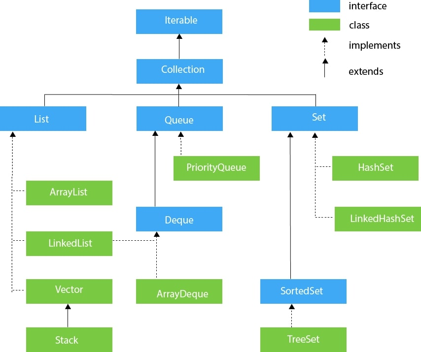

# llt-daily-dsa
Daily picks of interesting DSA problems.
 
### Day-1
#### Difficulty: 
#### Question Name:
#### Topic Tags: 
#### Link To Question:

### Day-2
#### Difficulty: Medium
#### Question Name: Maximum Subarray
#### Topic Tags: Array, Divide and Conquer, Dynamic Programming
#### Link To Question: https://leetcode.com/problems/maximum-subarray/

### JAVA Collection Hierarchy

